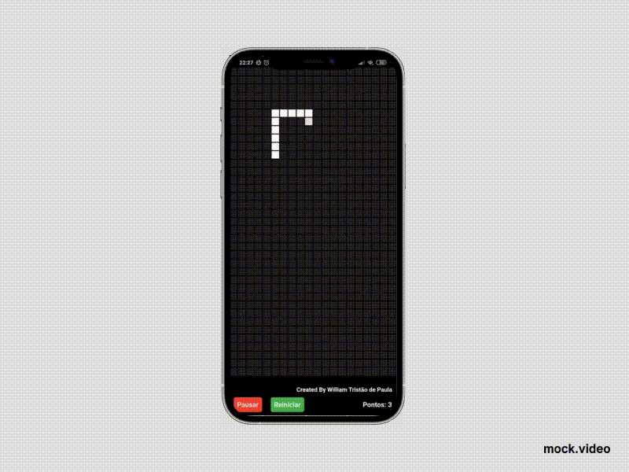

# FlutterSnakeGame
⭐ This is a Snake Game developed in Flutter, using object oriented programing, BLOC and Streams ⭐ 

## The Game



## Configuration Steps

Cloning the repository:
```
$ git clone https://github.com/williamtdepaula/FlutterSnakeGame.git
```

Open the project:
```
$ cd snake_game
```

Now run the app on your connected device (using terminal):
```
$ flutter run
```
[](https://www.gnu.org/licenses/gpl-3.0)
